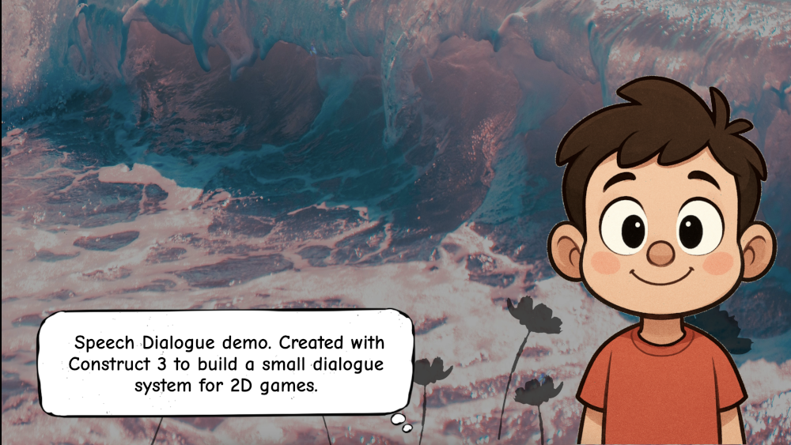

# Speech Bubble 💬🗣️

**WordGame** is a simple project built using [Construct 3](https://www.construct.net/) that serves as the foundation for a dialogue system.

This repository is intended for learning, experimenting, and eventually expanding into a fully playable dialogue game/system.

  
   
  <a href="https://hielo777.github.io/SpeechBubble/">
    Click here to try the demo >>
  </a>

---
 ##  📥 How to Use / Run :

 Overall Insructions 

1. Open the project with **Construct 3** (https://editor.construct.net/).
2. Select the PrepDialogue Layout
3. Run the layout or preview the project.
4. The game will prompt you to load the dialogue, and background.
5. Presss the "Ready" button, in the upper right corner.
6. Press the Space Bar to move forward in the dialogue.

> Make sure you have access to the internet or a licensed version of Construct 3 if using features that require it.
>> The basic versions of this projects should be under the free version restrictions, to allow anyone to check it out

(<a href="#readme-top">⬆  back to top  ⬆</a>)

---

##  📦 Features

 Current progress 

- Load a custom dialogue at the start of the demo
    - Every line in the dialogue should be separated by an end of line character
    - Every line will displayed inside a speech bubble
    - Dialogue lines should be limited to 50 to 80 characters
- Load a custom background image at the start of the demo
- Once the dialogue is loaded, the animated character will "talk" using the scripted dialogue
- Use the space bar to display the next line in the Dialogue
- Simplified the game events from the original demo by @ViridinoStudios, keeping only the logic needed for the speech bubble demo
    - In progress. Should simplify even more!!
- Working demo exported and published in the project's repo

(<a href="#readme-top">⬆  back to top  ⬆</a>)

---
